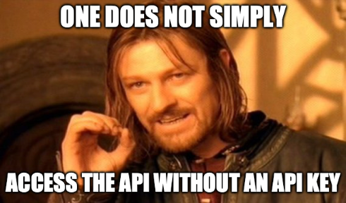
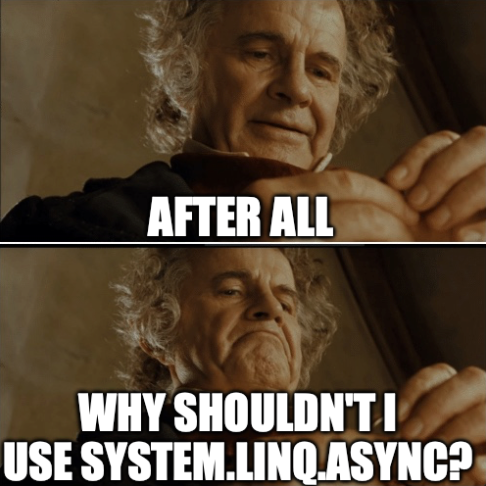

# Mellon

Speak, friend, and enter! A C# SDK for [The One API](https://the-one-api.dev), an API that serves your needs regarding data about The Lord of the Rings, the epic books by J. R. R. Tolkien and the official movie adaptions by Peter Jackson.


> This SDK only implements movies and quotes so far.

## Install the SDK

This SDK can be installed from NuGet:

```bash
dotnet add package JimBobBennett.Mellon
```

## Get an API key



Before you can use the SDK, you need an API key for [The One API](https://the-one-api.dev). Sign up at [the-one-api.dev/sign-up](https://the-one-api.dev/sign-up) to get your key.

## Use the SDK

The entry point to the SDK is the `TheOneAPIClient` class. To create this, you need to pass the API key in via an instance of `TheOneAPICredentials`:

```csharp
var client = new TheOneAPIClient(new TheOneAPICredentials(<apiKey>));
```


The API key should be set using [dotnet user secrets](https://learn.microsoft.com/aspnet/core/security/app-secrets) or another mechanism to pass them at run time, and not hard coded.

The client loads data from The One Api in pages, defaulting to 1000 records per page. You can configure the page size if you want by passing it to the constructor:

```csharp
var client = new TheOneAPIClient(new TheOneAPICredentials(<apiKey>), <page size>);
```

The client exposes 2 properties:

- `Movies` - a list of all the Lord of the Rings and Hobbit movies
- `Quotes` - a list of all the quotes from the Lord of the Rings and Hobbit movies

These are async enumerables, and lazy load from the API as you access them.

```csharp
await foreach (var movie in client.Movies)
{
    Console.WriteLine(movie.Name);
}

await foreach (var quote in client.Quotes)
{
    Console.WriteLine(quote.Dialog);
}
```

The client also has a method to get quotes for a single movie, taking the Id of the movie:

```csharp
var quotesForMovie = client.QuotesForMovie(movie.Id);

await foreach (var quote in quotesForMovie)
{
    Console.WriteLine(quote.Dialog);
}
```

The async enumerables that are returned from the `Movies`, `Quotes` and `QuotesForMovie` have helper functions to count the number of items and retrieve a single item by Id:

```csharp
var count = await Movies.CountAsync();

var fellowshipOfTheRings = await Movies.GetAsync("5cd95395de30eff6ebccde5c");
```



You can also use `System.Linq.Async` on the async enumerables:

```bash
dotnet add package System.Linq.Async
```

```csharp
var first = await movies.FirstAsync();
```

## Building and testing the SDK

This repo contains a `devcontainer` configuration, so can be run in either [GitHub codespaces](https://github.com/features/codespaces), or locally using a [remote container in VS Code](https://code.visualstudio.com/docs/devcontainers/containers). To run locally you will need Docker installed.

The dev container is configured with .NET 7.0 as well as all the recommended extensions. If you want to build locally, you will need .NET 7.0 installed. Instructions to do this are in the [DotNet documentation](https://dotnet.microsoft.com/).

This repo has 3 projects:

- `Mellon` - The SDK
- `Mellon.Test` - Unit tests for the SDK
- `Mellon.IntegrationTest` - Integration tests for the SDK that hit The One API endpoint
You can build and run the tests as normal:

```bash
dotnet build
dotnet test
```

The integration tests need an API key to work as they query the API. This needs to be set as a user secret, or set in the `configuration.json` file in the `Mellon.IntegrationTest` project.

```bash
cd Mellon.IntegrationTest
 dotnet user-secrets set "TheOneApi:apiKey" "<api key>"
```

## Contributing to this project

Want to add the rest of the APIs? That would be awesome.

- Start by [raising an issue](https://github.com/jimbobbennett/JimBennett-SDK/issues) so we can track the work.
- Fork the repo and make your change
- Raise a PR. THis repo is configured to run all the unit and integration tests before allowing a PR through, so make sure your tests work!